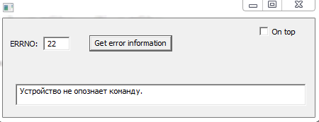

# Show_error_information
 Отображение описания ошибки в Windows по её коду

 

Всем привет, вот решил написать небольшую програмку, которая выводит описание ошибки error в Windows по её коду.

Для чего это нужно ?

В Windows 500 кодов ошибок и каждый раз искать некруто, а тут удобный (Я надеюсь, хе-хе, гуй), который выведет описание введённой ошибки.

Идея взята из книжки Рихтера "Создание эффективных Win32-приложений", я там-чуть подправил, кода немного можете взять механизм получения описания ошибки себе...

Также можете глянуть способ создания окна, он тоже немного необычный, но в целом удобно...)))

Собранная версия программы тут:\Release\error_show.exe

Добро пожаловать в новый раздел:https://ru-sfera.org/forums/sistemnoe-programmirovanie-i-razrabotka.160/
